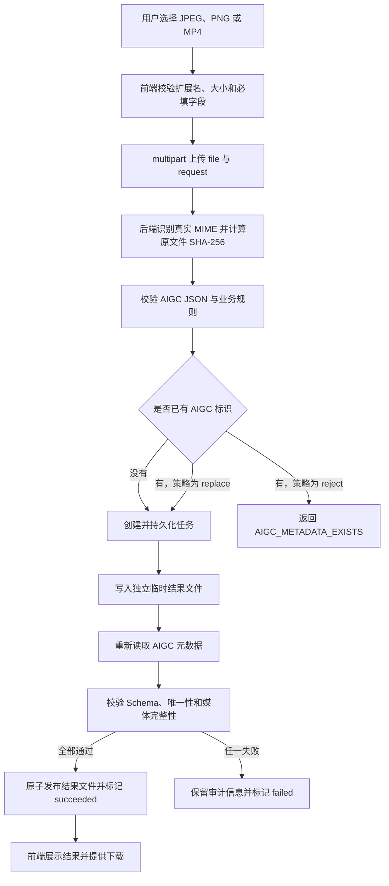

# GB 45438—2025 图片与视频隐式元数据标注开发手册

> 文档版本：1.0
> 更新日期：2026-08-16
> 适用范围：首期 JPEG、PNG 图片与 MP4 视频的文件元数据隐式标识
> 文档状态：前后端联调基线

## 1. 文档目的

本手册定义 MarkTool 首期“隐式元数据标注”功能的接口契约、处理流程、校验规则、前后端职责和验收标准。前端与后端应以本手册作为共同开发基线，在不依赖具体框架的前提下并行开发。

> 设计理由：首期开发由不同队员分别负责前端和后端。如果只约定页面或函数名称，双方很容易在字段拼写、状态含义和错误处理上产生分歧；先固定协议和流程可以显著降低联调成本。

本手册不规定具体代码目录、编程语言或框架。技术栈建议及选择理由统一放在第 17 章，不影响前述接口契约。

> 设计理由：接口是团队间的稳定边界，而技术实现可以替换。将两者分开，有利于后续更换元数据工具、任务队列或存储方案而不重做前端。

## 2. 依据与规则优先级

本功能依据以下材料设计：

1. `GB 45438—2025 网络安全技术 人工智能生成合成内容标识方法`，重点参考第 6 章、规范性附录 E 和资料性附录 F。
2. 项目文档《第三章 产品与研发》中“板块一：打标 / 修复标识”的隐式元数据部分。
3. 本开发手册定义的项目级接口和工程约束。

发生不一致时，采用以下优先级：

```text
规范性附录 E > 标准正文 > 资料性附录 F > 项目文档 > 本手册中的示例数据
```

> 设计理由：附录 E 是规范性内容，附录 F 只是示例。附录 F 的图片中可能出现字段缩写或拼写差异，开发时不能用资料性示例覆盖规范性字段定义。

本手册使用以下约束词：

- **必须**：违反后不能通过验收。
- **应该**：原则上执行，偏离时需要记录理由。
- **可以**：可选能力，不影响首期验收。

## 3. 首期范围

### 3.1 支持范围

| 模态 | 文件格式 | MIME 类型 | 本期能力 |
|---|---|---|---|
| 图片 | JPEG/JPG | `image/jpeg` | 写入、回读并校验 AIGC 元数据 |
| 图片 | PNG | `image/png` | 写入、回读并校验 AIGC 元数据 |
| 视频 | MP4 | `video/mp4` | 写入、回读并校验 AIGC 元数据，不转码 |

> 设计理由：JPEG、PNG 和 MP4 覆盖项目首期的主要演示场景，同时可以分别验证图片 XMP 和视频容器元数据两条处理链路，范围足够完整但仍可控。

### 3.2 明确不在首期范围内

- 文本和音频模态。
- GIF、WebP、HEIC、MOV、MKV 等其他格式。
- 显式文字、语音或画面标识。
- TrustMark、AudioSeal 等内容水印。
- C2PA 与国标互转。
- AI 生成概率检测。
- 批量上传和批量标注。
- 数字签名与密钥管理。
- 对已有标识进行字段级合并。

> 设计理由：首期目标是把“上传一个文件—写入一份国标元数据—回读确认—下载结果”的最短闭环跑通。把水印、签名或更多格式同时加入，会使失败原因和验收边界变得模糊。

## 4. 核心设计决策

### 4.1 使用双层数据结构

前端向后端提交结构化 JSON；后端只将其中的 `AIGC` 对象序列化为国标要求的字符串，并写入媒体文件。

> 设计理由：结构化 JSON 适合表单校验和接口传输；文件元数据则要求保存确定格式的字符串。由后端统一完成最后的序列化，可以避免前后端重复转义和格式漂移。

### 4.2 文件与参数使用 multipart 提交

创建标注任务时必须使用 `multipart/form-data`，其中：

- `file`：原始二进制文件。
- `request`：媒体类型为 `application/json` 的标注参数。

> 设计理由：图片和视频不适合转换为 Base64 后放入 JSON。Base64 会扩大数据体积并增加内存消耗，而 multipart 可以直接传输文件流和结构化参数。

### 4.3 默认不覆盖已有标识

如果文件已经存在 AIGC 元数据，默认策略必须是拒绝写入；只有用户明确选择“替换已有标识”时，后端才可以先移除旧标识再写入新标识。

> 设计理由：国标要求文件中仅保留一份文件元数据隐式标识。默认拒绝可以避免误覆盖来源信息，也可以防止简单追加产生多份标识。

### 4.4 不覆盖原文件

后端必须保留原文件，并生成独立的标注结果文件。只有结果文件完成回读校验后，任务才可以标记为成功。

> 设计理由：元数据写入仍然属于文件修改。保留原文件便于失败恢复、前后对比和审计，也能避免处理工具异常造成不可逆的数据损失。

### 4.5 图片和视频共用接口、使用不同载体适配器

前端和公共 API 不暴露 XMP、atom 等底层差异。后端内部根据真实文件类型选择图片或视频元数据适配器。

> 设计理由：用户执行的是同一种业务操作。把文件容器差异封装在后端，可以保持页面和接口稳定，并为以后增加其他格式预留扩展点。

## 5. 国标 AIGC 数据模型

### 5.1 标准结构

前端提交和后端回传时，`AIGC` 对象必须使用以下字段名称和大小写：

```json
{
  "AIGC": {
    "Label": "1",
    "ContentProducer": "ORG_1565201000000016",
    "ProduceID": "0198F21A-6F28-7000-A102-123456789ABC",
    "ReservedCode1": "",
    "ContentPropagator": "ORG_1565201000000016",
    "PropagateID": "0198F21A-6F28-7000-A102-123456789ABC",
    "ReservedCode2": ""
  }
}
```

> 设计理由：直接沿用规范性附录 E 的字段名，可以减少前后端映射，也能避免 `Propagator`、`PropatorID` 等非规范写法进入生产数据。

### 5.2 字段定义

| 字段 | 必填 | 类型 | 首期规则 | 说明 |
|---|---:|---|---|---|
| `Label` | 是 | 字符串 | 只能为 `"1"`、`"2"`、`"3"` | 内容的 AI 生成合成属性 |
| `ContentProducer` | 是 | 字符串 | 非空，使用机构名称或编码 | 生成合成服务提供者 |
| `ProduceID` | 是 | 字符串 | 非空且在提供者范围内唯一 | 内容制作编号 |
| `ReservedCode1` | 是 | 字符串 | 首期默认为空字符串 | 生成方安全防护预留字段 |
| `ContentPropagator` | 是 | 字符串 | 首次写入时等于 `ContentProducer` | 内容传播服务提供者 |
| `PropagateID` | 是 | 字符串 | 首次写入时等于 `ProduceID` | 内容传播编号 |
| `ReservedCode2` | 是 | 字符串 | 首期默认为空字符串 | 传播方安全防护预留字段 |

> 设计理由：七个字段都固定存在，能让前端、后端、检测器和测试夹具共享同一种数据形状。未启用的预留能力用空字符串表达，不通过删字段表达。

### 5.3 Label 枚举

| 值 | 含义 | 前端显示文案 |
|---|---|---|
| `"1"` | 属于人工智能生成合成内容 | 属于 AI 生成合成内容 |
| `"2"` | 可能为人工智能生成合成内容 | 可能为 AI 生成合成内容 |
| `"3"` | 疑似为人工智能生成合成内容 | 疑似为 AI 生成合成内容 |

> 设计理由：`Label` 在标准中是字符串而不是数字。前端使用单选或下拉选项，可以阻止用户输入其他值，并避免把 `1` 错误地序列化为数值。

### 5.4 首次写入默认值

首次标注时，系统必须自动执行：

```text
ContentPropagator = ContentProducer
PropagateID = ProduceID
ReservedCode1 = ""
ReservedCode2 = ""
```

> 设计理由：附录 E 对首次写入时生产者和传播者的关系作出了说明。自动填充既符合规则，也能减少普通用户需要理解和填写的字段数量。

### 5.5 字符约束

首期 UI 应将机构编码和编号限制在不含空格的 ASCII 安全集合内。建议允许：

```text
! 以及 # 到 [、] 到 ~ 范围内的单字节字符
```

首期表单应直接禁止双引号、反斜杠、空格和换行。中文名称如需使用，应在后续完成跨工具、跨平台兼容性测试后再开放。

> 设计理由：这是比标准“应主要由指定字符构成”更严格的 MVP 子集，目的是降低 XMP、MP4 元数据工具和 JSON 转义之间的兼容风险，并不代表产品永久禁止中文。

### 5.6 ProduceID 生成规则

默认由系统在提交前生成 UUID 或 ULID；可以由前端使用可靠的 UUID/ULID 实现生成，也可以由前端调用后端的编号服务获取。无论采用哪种方式，创建任务的最终请求中必须包含非空 `ProduceID`，后端还必须检查其格式和重复情况。高级模式可以允许有自有编号体系的机构覆盖该值。

> 设计理由：`ProduceID` 必须唯一，而且它属于最终 AIGC 标准对象，因此在任务进入写入阶段前必须确定。把生成方式留作实现选择可以保持接口与技术栈无关，后端的重复检查则提供最终一致性保障。

### 5.7 推荐 JSON Schema

前后端应共享同一份 JSON Schema。首期推荐约束如下：

```json
{
  "$schema": "https://json-schema.org/draft/2020-12/schema",
  "title": "GB 45438-2025 Appendix E AIGC Metadata",
  "type": "object",
  "additionalProperties": false,
  "required": ["AIGC"],
  "properties": {
    "AIGC": {
      "type": "object",
      "additionalProperties": false,
      "required": [
        "Label",
        "ContentProducer",
        "ProduceID",
        "ReservedCode1",
        "ContentPropagator",
        "PropagateID",
        "ReservedCode2"
      ],
      "properties": {
        "Label": {
          "type": "string",
          "enum": ["1", "2", "3"]
        },
        "ContentProducer": {
          "type": "string",
          "minLength": 1
        },
        "ProduceID": {
          "type": "string",
          "minLength": 1
        },
        "ReservedCode1": {
          "type": "string"
        },
        "ContentPropagator": {
          "type": "string",
          "minLength": 1
        },
        "PropagateID": {
          "type": "string",
          "minLength": 1
        },
        "ReservedCode2": {
          "type": "string"
        }
      }
    }
  }
}
```

> 设计理由：Schema 固定了字段、类型、枚举和未知字段策略，可以同时驱动前端校验、后端校验和契约测试。字符限制建议作为单独的业务校验实现，以便后续在兼容性验证完成后独立调整。

## 6. 文件内嵌格式

### 6.1 必须写入的字符串

后端只把标准对象序列化为紧凑 JSON，示例如下：

```json
{"AIGC":{"Label":"1","ContentProducer":"ORG_1565201000000016","ProduceID":"0198F21A-6F28-7000-A102-123456789ABC","ReservedCode1":"","ContentPropagator":"ORG_1565201000000016","PropagateID":"0198F21A-6F28-7000-A102-123456789ABC","ReservedCode2":""}}
```

`standard`、`modality`、任务编号、文件哈希和处理时间不得放入上述对象。

> 设计理由：这些字段属于平台运行数据，不属于附录 E 的标准结构。将业务字段混入 AIGC JSON 会破坏严格 Schema 校验，并降低与外部工具的互操作性。

### 6.2 序列化规则

- 必须使用合法 JSON。
- 必须以 UTF-8 处理接口数据。
- 必须保留字段名称大小写。
- 不得把整个 JSON 再包装成带额外引号的二次 JSON 字符串。
- 为了测试稳定性，建议按第 5.2 节表格中的字段顺序输出。

> 设计理由：JSON 对象本身不要求字段顺序，但稳定顺序有利于快照测试、调试和哈希比对；禁止二次序列化可以避免文件中出现大量多余的转义符。

### 6.3 图片载体要求

JPEG 和 PNG 应使用 XMP 扩展字段保存标识。字段名称、完整属性名或关键词中必须包含 `AIGC`，字段值必须是第 6.1 节的完整字符串。

> 设计理由：项目文档已经选择 XMP 作为图片元数据载体，而且 XMP 可用于 JPEG 和 PNG。统一图片载体可以减少读取器和测试夹具的分支。

图片适配器必须保证：

- 不改变图片宽高。
- 不主动重新压缩像素数据。
- 不删除与 AIGC 无关的原有元数据，除非底层格式无法安全保留并已明确记录。
- 写入完成后可以通过独立读取路径找到唯一一份 AIGC 标识。

> 设计理由：本功能是“元数据标注”而不是图片编辑。保持像素和无关元数据稳定，可以避免引入画质变化、版权信息丢失等额外风险。

### 6.4 MP4 载体要求

MP4 应使用名称或关键词包含 `AIGC` 的可写元数据项或 atom 保存第 6.1 节的字符串。实现必须记录实际使用的载体位置，并在任务结果中返回载体标识。

> 设计理由：国标定义了字段名称与值，但没有锁定 MP4 内部的唯一 box 路径。显式记录载体位置，可以让检测器、迁移工具和兼容性测试保持一致。

MP4 适配器必须保证：

- 不重新编码音视频流。
- 不改变视频时长、分辨率、音视频轨道数量和主要编解码器信息。
- 可以进行容器级重封装，但必须完成播放和媒体完整性校验。

> 设计理由：重新编码会显著增加耗时，还可能改变内容质量。本期只需要写入容器元数据，优先采用流复制或只修改容器结构更符合功能边界。

## 7. API 约定

### 7.1 通用约定

- API 前缀：`/api/v1`。
- JSON 字段统一使用 `snake_case`，国标规定的 `AIGC` 内部字段除外。
- 时间统一使用 UTC 的 ISO 8601 字符串，例如 `2026-08-16T08:30:00Z`。
- 每个响应都应提供或通过响应头提供 `request_id`。
- 文件下载接口不得返回服务器绝对路径。

> 设计理由：版本前缀允许接口演进；`snake_case` 与现有项目接口风格一致；统一时间和请求编号便于前后端日志关联；隐藏绝对路径可以避免泄露服务器目录结构。

### 7.2 创建标注任务

```http
POST /api/v1/metadata-label-jobs
Content-Type: multipart/form-data
Idempotency-Key: <optional-client-generated-key>
```

multipart 字段：

| 名称 | 类型 | 必填 | 说明 |
|---|---|---:|---|
| `file` | 二进制文件 | 是 | JPEG、PNG 或 MP4 |
| `request` | `application/json` | 是 | 标注参数 |

> 设计理由：可选的 `Idempotency-Key` 可以防止浏览器重试或网络抖动创建两个相同任务，视频上传时尤其有价值。

`request` 示例：

```json
{
  "standard": "GB45438-2025",
  "modality": "image",
  "existing_metadata_policy": "reject",
  "AIGC": {
    "Label": "1",
    "ContentProducer": "ORG_1565201000000016",
    "ProduceID": "0198F21A-6F28-7000-A102-123456789ABC",
    "ReservedCode1": "",
    "ContentPropagator": "ORG_1565201000000016",
    "PropagateID": "0198F21A-6F28-7000-A102-123456789ABC",
    "ReservedCode2": ""
  }
}
```

字段规则：

| 字段 | 合法值 | 说明 |
|---|---|---|
| `standard` | 固定为 `GB45438-2025` | 为后续标准扩展保留路由信息 |
| `modality` | `image` 或 `video` | 前端声明值，后端仍需按文件内容复核 |
| `existing_metadata_policy` | `reject` 或 `replace` | 默认 `reject`，首期不支持 `merge` |
| `AIGC` | 第 5 章定义的对象 | 最终写入文件的标准数据 |

> 设计理由：使用枚举策略比简单的 `replace_existing` 布尔值更容易扩展，也让请求意图更清晰；明确不支持 `merge` 是因为合并容易产生来源语义不明或多份标识。

创建成功后返回 `202 Accepted`：

```json
{
  "request_id": "req_01K2...",
  "job_id": "job_01K2...",
  "status": "queued",
  "stage": "queued",
  "progress": null,
  "created_at": "2026-08-16T08:30:00Z",
  "links": {
    "self": "/api/v1/metadata-label-jobs/job_01K2...",
    "output": null
  }
}
```

> 设计理由：视频处理时间不稳定，创建接口只确认任务已经安全接收并持久化，不要求客户端一直保持连接。`progress` 允许为空，避免后端在无法精确估算时提供虚假的百分比。

### 7.3 查询任务状态

```http
GET /api/v1/metadata-label-jobs/{job_id}
```

处理中响应示例：

```json
{
  "request_id": "req_01K2...",
  "job_id": "job_01K2...",
  "status": "running",
  "stage": "verifying",
  "progress": null,
  "created_at": "2026-08-16T08:30:00Z",
  "updated_at": "2026-08-16T08:30:08Z",
  "input": {
    "original_file_name": "sample.mp4",
    "detected_mime_type": "video/mp4",
    "size_bytes": 10485760,
    "sha256": "..."
  },
  "output": null,
  "validation": null,
  "error": null,
  "links": {
    "self": "/api/v1/metadata-label-jobs/job_01K2...",
    "output": null
  }
}
```

> 设计理由：`status` 表示面向用户的总体状态，`stage` 表示内部阶段。二者分开后，前端只需要对少量状态编写逻辑，同时仍能显示“正在校验”等更具体的信息。

成功响应示例：

```json
{
  "request_id": "req_01K2...",
  "job_id": "job_01K2...",
  "status": "succeeded",
  "stage": "completed",
  "progress": 100,
  "created_at": "2026-08-16T08:30:00Z",
  "updated_at": "2026-08-16T08:30:12Z",
  "input": {
    "original_file_name": "sample.mp4",
    "detected_mime_type": "video/mp4",
    "size_bytes": 10485760,
    "sha256": "..."
  },
  "output": {
    "file_name": "sample_labeled.mp4",
    "mime_type": "video/mp4",
    "size_bytes": 10487001,
    "sha256": "...",
    "carrier": "mp4-aigc-v1",
    "download_url": "/api/v1/metadata-label-jobs/job_01K2.../output",
    "expires_at": "2026-08-23T08:30:12Z"
  },
  "embedded_metadata": {
    "AIGC": {
      "Label": "1",
      "ContentProducer": "ORG_1565201000000016",
      "ProduceID": "0198F21A-6F28-7000-A102-123456789ABC",
      "ReservedCode1": "",
      "ContentPropagator": "ORG_1565201000000016",
      "PropagateID": "0198F21A-6F28-7000-A102-123456789ABC",
      "ReservedCode2": ""
    }
  },
  "validation": {
    "read_back_succeeded": true,
    "schema_valid": true,
    "single_aigc_record": true,
    "media_integrity_valid": true
  },
  "error": null,
  "links": {
    "self": "/api/v1/metadata-label-jobs/job_01K2...",
    "output": "/api/v1/metadata-label-jobs/job_01K2.../output"
  }
}
```

> 设计理由：成功结果同时返回文件、实际回读到的元数据和校验结论。前端展示的是“后端真正写入并读回的数据”，而不是用户最初提交但可能写入失败的数据。

### 7.4 下载结果文件

```http
GET /api/v1/metadata-label-jobs/{job_id}/output
```

响应必须设置正确的 `Content-Type` 和安全的下载文件名。只有 `succeeded` 状态的任务可以下载。

> 设计理由：把状态 JSON 与二进制下载分成两个接口，可以分别处理缓存、鉴权和错误信息，也避免在同一个响应中混合文件与校验结果。

### 7.5 健康检查

```http
GET /api/v1/health
```

建议响应：

```json
{
  "status": "ok",
  "capabilities": {
    "image/jpeg": true,
    "image/png": true,
    "video/mp4": true
  }
}
```

> 设计理由：除了判断服务是否在线，返回能力列表还能帮助前端在部分适配器不可用时隐藏或禁用相应入口。

## 8. 任务状态与处理流程

### 8.1 状态定义

| `status` | 含义 | 是否终态 |
|---|---|---:|
| `queued` | 已接收并等待执行 | 否 |
| `running` | 正在校验、写入或回读 | 否 |
| `succeeded` | 写入和全部强制校验通过 | 是 |
| `failed` | 任一强制步骤失败 | 是 |

`stage` 推荐值：

```text
queued
validating_request
inspecting_file
checking_existing_metadata
writing_metadata
verifying_metadata
verifying_media
publishing_output
completed
failed
```

> 设计理由：稳定的状态集合便于前端实现状态机；更细的阶段值便于进度展示和排查故障。阶段可以增加，但已有含义不应被改变。

### 8.2 完整流程



> 设计理由：写入后重新读取是整个流程的质量闸门。工具退出码为 0 只能说明命令执行完成，不能证明字段写到了正确位置、只有一份或媒体仍然可用。

### 8.3 前端轮询规则

前端在收到 `202` 后轮询任务状态。建议开始时每 1 秒一次，持续一段时间后放宽到每 2 至 3 秒；进入终态、页面离开或请求被取消时停止轮询。

> 设计理由：固定高频轮询会对长视频任务产生不必要的请求压力；逐步退避可以兼顾早期响应速度和后端负载。

如果 `progress` 为 `null`，前端应显示阶段式或不定进度动画，不得自行伪造百分比。

> 设计理由：视频容器处理很难在所有工具下精确计算进度。诚实显示当前阶段比不准确的百分比更可信。

## 9. 后端处理要求

### 9.1 请求预检

后端必须依次完成：

1. 检查 multipart 字段是否完整。
2. 解析 `request` JSON。
3. 根据文件头识别真实格式和 MIME 类型。
4. 比对声明的 `modality` 与实际文件类型。
5. 检查可配置的文件大小上限。
6. 计算原文件 SHA-256。
7. 校验 AIGC Schema 和业务规则。
8. 检查是否已有 AIGC 标识。

> 设计理由：前端校验只能改善用户体验，不能作为安全或合规边界。所有关键条件都必须在后端重新验证。

### 9.2 安全写入

后端必须先写入同一存储区域内的临时结果文件，完成全部验证后再以原子方式发布为正式结果文件。任何失败都不得把半成品暴露给下载接口。

> 设计理由：进程退出、磁盘空间不足或工具异常都可能留下不完整文件。临时写入加原子发布可以保证用户只能下载到完整结果。

### 9.3 旧标识处理

- `reject`：发现任何 AIGC 标识时停止处理并返回冲突错误。
- `replace`：完整移除所有可识别的旧 AIGC 标识，确认数量为零后写入一份新标识。
- 首期禁止字段级 `merge`。

> 设计理由：直接在旧对象上合并可能保留过期的传播者或签名信息，并且难以证明最终只有一份规范标识。整体替换的行为更明确、更容易测试。

### 9.4 回读验证

结果文件必须通过以下检查：

- 可以找到且只找到一份 AIGC 标识。
- 元数据字符串可以解析为 JSON。
- 解析结果通过共享 JSON Schema。
- 回读对象与计划写入对象逐字段一致。
- 图片可以解码且宽高不变。
- MP4 可以探测和播放，时长、分辨率、轨道数量与主要编解码器信息没有非预期变化。

> 设计理由：这些检查同时覆盖合规正确性和媒体可用性。只检查 JSON 会漏掉文件损坏，只检查文件可播放又会漏掉字段写错或重复标识。

### 9.5 审计记录

每个任务至少保存：

- `job_id` 和 `request_id`。
- 原文件名、真实 MIME、大小和 SHA-256。
- 输出文件名、大小和 SHA-256。
- 用户提交的 AIGC 对象。
- 实际回读的 AIGC 对象。
- 载体类型和适配器版本。
- 创建、开始、完成时间。
- 每个校验项的结果。
- 失败阶段、错误码和安全化后的错误摘要。

> 设计理由：审计记录能回答“谁对哪个文件写了什么、实际写入结果是什么、使用了哪个处理版本”，是后续合规报告、故障复现和篡改检测的基础。

## 10. 前端页面要求

### 10.1 页面结构

推荐按以下顺序组织单文件标注页面：

1. 模态选择：图片或视频。
2. 文件上传区。
3. 标识属性：`Label`。
4. 生成者信息：`ContentProducer`。
5. 内容编号：默认自动生成，可在高级模式修改。
6. 高级设置：传播者、传播编号、预留字段、已有标识策略。
7. 只读 JSON 预览。
8. 提交按钮。
9. 任务进度与阶段。
10. 结果校验摘要和下载按钮。

> 设计理由：高频必填项放在主流程，低频技术字段折叠在高级设置中，可以降低用户第一次使用时的认知负担，同时不牺牲专业用户的控制能力。

### 10.2 上传区行为

- 只允许单文件。
- 根据当前模态设置 `accept`。
- 显示文件名、格式、大小；图片显示缩略图，视频显示基本信息。
- 前端发现明显错误时立即提示，但仍以服务端校验结果为准。

> 设计理由：首期接口只处理一个文件，单文件交互能避免批量任务状态、部分失败和多结果下载等额外复杂度。

### 10.3 表单行为

- `Label` 使用受控枚举组件。
- `ContentProducer` 必填。
- `ProduceID` 默认由系统在提交前生成，最终请求中必须包含确定值。
- 首次写入时传播字段自动同步生成字段。
- 用户修改传播字段后，应停止自动同步并明确提示。
- 预留字段默认隐藏且为空。

> 设计理由：自动同步能满足首次写入规则，但用户主动修改后继续覆盖会造成数据丢失，因此需要从自动模式切换为人工模式。

### 10.4 JSON 预览

页面应提供只读的标准 JSON 预览，并与表单实时同步。预览只显示最终 `AIGC` 对象，不显示任务控制字段。

> 设计理由：JSON 预览可以让开发、测试和专业用户在提交前确认字段与大小写，也能清楚区分“写入文件的数据”和“平台任务数据”。

### 10.5 已有标识冲突

后端返回 `AIGC_METADATA_EXISTS` 时，前端应展示已有标识摘要，并要求用户明确选择取消或整体替换，不得自动重试为 `replace`。

> 设计理由：替换已有来源信息是有业务含义的操作，必须由用户明确确认，不能由客户端静默升级权限。

### 10.6 成功结果

成功页至少展示：

- “已写入并通过回读校验”的明确状态。
- 原文件和结果文件 SHA-256 摘要。
- 实际回读的 AIGC JSON。
- 四项校验结果。
- 结果文件下载按钮和过期时间。

> 设计理由：仅显示“上传成功”无法证明标识真正写入。把回读结果和校验项展示出来，可以让用户区分上传、处理和合规验证三个阶段。

## 11. 错误响应

### 11.1 同步错误结构

```json
{
  "request_id": "req_01K2...",
  "error": {
    "code": "AIGC_SCHEMA_INVALID",
    "message": "AIGC 元数据不符合 GB 45438-2025 附录 E 结构。",
    "field_errors": [
      {
        "field": "AIGC.Label",
        "reason": "必须是字符串 1、2 或 3。"
      }
    ]
  }
}
```

> 设计理由：稳定的机器错误码供前端分支处理，中文 `message` 供用户阅读，`field_errors` 可以精确定位表单问题。三者不能互相替代。

### 11.2 推荐错误码

| HTTP/任务状态 | 错误码 | 含义 | 前端处理 |
|---|---|---|---|
| 400 | `INVALID_MULTIPART` | 请求结构错误 | 提示重新选择文件并提交 |
| 413 | `FILE_TOO_LARGE` | 超过配置上限 | 显示当前上限 |
| 415 | `UNSUPPORTED_MEDIA_TYPE` | 不是 JPEG、PNG 或 MP4 | 显示支持格式 |
| 422 | `AIGC_SCHEMA_INVALID` | AIGC 结构或类型错误 | 标记具体字段 |
| 422 | `AIGC_CHARACTER_INVALID` | 字符不符合首期约束 | 标记具体字段 |
| 422 | `MODALITY_MISMATCH` | 声明模态与真实类型不一致 | 要求重新选择模态 |
| 409 | `AIGC_METADATA_EXISTS` | 已有标识且策略为拒绝 | 请求用户确认替换 |
| 404 | `JOB_NOT_FOUND` | 任务不存在或已过期 | 返回任务列表或重新提交 |
| `failed` | `METADATA_WRITE_FAILED` | 写入工具失败 | 展示可行动的摘要 |
| `failed` | `METADATA_READBACK_FAILED` | 写入后无法读取 | 禁止下载结果 |
| `failed` | `AIGC_DUPLICATE_RECORDS` | 存在多份标识 | 禁止下载结果 |
| `failed` | `MEDIA_INTEGRITY_FAILED` | 媒体完整性检查失败 | 禁止下载结果 |
| 500 | `INTERNAL_ERROR` | 未分类内部错误 | 显示 request_id，隐藏堆栈 |

> 设计理由：对用户可修复的错误和系统处理失败进行区分，可以避免前端统一显示“服务器错误”，也便于测试覆盖和运行监控。

### 11.3 异步失败结构

异步任务失败时，状态接口返回 `status: "failed"`，并包含：

```json
{
  "error": {
    "code": "METADATA_READBACK_FAILED",
    "message": "元数据写入后未能通过回读校验。",
    "retryable": false
  }
}
```

> 设计理由：异步错误发生在创建请求已经返回之后，不能再依赖原始 HTTP 状态码。把错误放入任务资源中，前端才能在轮询时稳定获取失败原因。

## 12. 存储与生命周期

### 12.1 数据分离

结构化任务记录保存在数据库或任务存储中；原文件和结果文件保存在文件系统或对象存储中；数据库只保存文件引用，不直接保存大型视频二进制。

> 设计理由：数据库适合查询状态和审计字段，文件存储适合大体积二进制。分离后备份、清理和扩容都更简单。

### 12.2 文件命名

物理存储名称必须使用服务端生成的不可预测 ID，不得直接使用用户文件名作为路径。下载时再通过响应头恢复安全化后的原始名称，例如 `sample_labeled.mp4`。

> 设计理由：用户文件名可能包含路径分隔符、重复名称或特殊字符。服务端随机命名可以防止路径穿越和文件覆盖。

### 12.3 保留策略

原文件、结果文件和任务记录的保留时间必须可配置。接口通过 `expires_at` 告知前端结果文件的可下载截止时间。

> 设计理由：视频占用空间较大，永久保存会快速耗尽磁盘；明确过期时间也能避免用户误以为下载链接长期有效。

## 13. 安全要求

- 必须按文件内容识别格式，不能只信任扩展名或浏览器 MIME。
- 必须限制文件大小、并发任务数和单任务处理时间。
- 必须对用户文件名做安全化处理。
- 调用外部媒体工具时必须使用参数数组，不得拼接用户输入形成 shell 命令。
- 处理目录必须与应用代码目录隔离。
- 下载接口不得接受任意文件路径。
- 错误响应不得返回堆栈、命令行、服务器绝对路径或敏感环境信息。
- 生产环境应增加身份认证、权限校验和操作审计。

> 设计理由：媒体文件属于不可信输入，而且底层处理工具通常权限较高。文件隔离、参数化调用和资源限制可以降低路径穿越、命令注入、拒绝服务及敏感信息泄露风险。

## 14. 与现有检测 MVP 的衔接

当前仓库已经存在图片元数据检测和报告流程。新增标注模块应复用同一套 AIGC Schema 和读取校验能力，写入流程的“回读验证”应调用公共检测服务，而不是另写一套宽松校验。

> 设计理由：如果写入器和检测器各自维护不同规则，可能出现“自己写入成功，但自己的检测器判定失败”或相反的情况。共用 Schema 和读取器可以形成真正闭环。

在接入新模块前，现有检测 Schema 应按规范性附录 E 完成以下校准：

- `Label` 限制为字符串 `"1"`、`"2"`、`"3"`。
- 七个字段全部进入标准对象。
- 使用 `ContentPropagator` 和 `PropagateID` 的准确拼写。
- 标准对象外层包含 `AIGC`。
- 根据团队决定启用首期字符约束。
- 对未知字段采用拒绝或明确告警策略。

> 设计理由：现有设计文档注明 Schema 曾依据公开信息近似定义。现在已经有标准原文，应在开发写入功能前先统一为准确结构，避免把旧近似定义固化到新接口中。

现有 `/api/detect` 可以继续保留；新增写入 API 使用 `/api/v1/metadata-label-jobs`。后续可以逐步把检测 API 也迁移到版本化路径，但不应为了本期功能强制重写现有报告页面。

> 设计理由：新增版本化接口可以建立长期规范，同时保留旧接口能控制改动范围，避免隐式标注功能被无关重构拖慢。

## 15. 测试与验收

### 15.1 契约测试

前后端必须使用固定样例验证：

- 合法请求可以创建任务并返回 `202`。
- JSON 字段名、类型和枚举严格一致。
- 所有响应符合本手册的数据结构。
- 每个错误码都能被前端映射为明确提示。

> 设计理由：契约测试关注团队交界面，比单独测试某个前端组件或后端函数更能提前发现联调问题。

### 15.2 AIGC 数据测试

至少覆盖：

1. `Label` 为 `"1"`、`"2"`、`"3"` 的合法样例。
2. `Label` 错误地传为数字 `1`。
3. 缺少七个字段中的任意一个。
4. 字段大小写错误。
5. 出现未知字段。
6. 生产者或编号为空。
7. 首期禁止字符。
8. 预留字段为空字符串。
9. 首次写入时传播字段与生产字段一致。

> 设计理由：这些用例直接覆盖附录 E 最容易发生的实现错误，尤其是字符串数字、字段缺失和拼写差异。

### 15.3 文件测试矩阵

| 场景 | JPEG | PNG | MP4 |
|---|---:|---:|---:|
| 无标识文件正常写入 | 必测 | 必测 | 必测 |
| 已有标识，策略 reject | 必测 | 必测 | 必测 |
| 已有标识，策略 replace | 必测 | 必测 | 必测 |
| 扩展名伪装 | 必测 | 必测 | 必测 |
| 损坏或截断文件 | 必测 | 必测 | 必测 |
| 写入后回读一致 | 必测 | 必测 | 必测 |
| 只有一份 AIGC 标识 | 必测 | 必测 | 必测 |
| 媒体内容保持可用 | 必测 | 必测 | 必测 |
| 大文件和超时 | 选测 | 选测 | 必测 |

> 设计理由：相同业务请求在三种容器中的失败方式不同。按文件格式建立矩阵可以防止“PNG 通过就认为 MP4 也完成”的错误判断。

### 15.4 兼容性测试

每种格式至少用两条独立读取路径验证。例如，写入器完成后，除了项目读取器，还使用一个独立工具检查字段存在性和内容。

> 设计理由：如果写入和读取都使用同一个有缺陷的实现，它们可能对同一种错误达成一致。独立读取路径能更真实地验证互操作性。

### 15.5 首期验收标准

只有同时满足以下条件，功能才算完成：

1. 用户可以在前端选择一张 JPEG/PNG 或一个 MP4。
2. 用户可以填写 `Label` 和 `ContentProducer`，其余首次写入字段正确自动生成。
3. 前端按照本手册 multipart 契约创建任务。
4. 后端异步处理并提供可查询状态。
5. 三种文件都能写入一份符合 Schema 的 AIGC 元数据。
6. 已有标识默认拒绝，明确确认后可以整体替换。
7. 写入后回读对象与提交对象逐字段一致。
8. 图片可正常解码且尺寸不变；MP4 可正常探测和播放，未发生转码。
9. 成功页面展示实际回读数据、校验结果和下载入口。
10. 原文件未被覆盖。
11. 所有必测用例通过。
12. 接口文档、共享 Schema 和错误码与实现一致。

> 设计理由：验收标准同时覆盖用户可见结果、接口一致性、国标数据正确性和媒体完整性，避免只以“接口返回 200”作为完成依据。

## 16. 团队协作与开发顺序

### 16.1 先冻结契约

前后端首先共同确认：

- 第 5 章数据模型。
- 第 7 章 API 路径和请求响应。
- 第 8 章状态值。
- 第 11 章错误码。
- 第 15 章验收样例。

确认后形成接口基线，字段删除、重命名或语义变化必须同步通知双方。

> 设计理由：这五部分直接决定联调。如果开发期间随意改变，会导致 Mock、前端类型和后端模型同时失效。

### 16.2 前端并行任务

1. 定义 API 类型和 Mock 数据。
2. 完成单文件上传与表单。
3. 完成 JSON 预览和客户端校验。
4. 完成任务状态轮询。
5. 完成已有标识冲突确认。
6. 完成成功、失败和下载页面。
7. 用 Mock 覆盖所有状态和错误码。

> 设计理由：前端不需要等待真实元数据写入器完成。只要 Mock 严格遵守接口契约，就可以先完成全部页面状态。

### 16.3 后端并行任务

1. 落地共享 JSON Schema 和业务校验器。
2. 实现上传预检与任务资源。
3. 实现 JPEG/PNG 适配器。
4. 实现 MP4 适配器。
5. 实现已有标识检测和替换。
6. 实现回读和媒体完整性校验。
7. 实现结果下载与清理策略。
8. 完成契约、格式和失败测试。

> 设计理由：后端按“模型—任务—适配器—验证—交付”的顺序开发，可以先固定公共能力，再隔离不同文件格式的风险。

### 16.4 联调顺序

建议按以下顺序联调：

```text
合法 PNG → 非法请求 → 已有标识冲突 → JPEG → 小型 MP4 → 大型 MP4 → 清理与过期
```

> 设计理由：PNG 测试文件容易生成和检查，适合先打通协议；MP4 的耗时和容器兼容问题更多，放在公共接口稳定后处理更高效。

## 17. 推荐技术栈及理由

本章是实现建议，不改变前述接口契约。

### 17.1 前端：React + TypeScript + Ant Design

推荐继续使用现有项目的 React、TypeScript 和 Ant Design，不重新搭建另一套前端框架。

> 推荐理由：现有页面、主题和组件已经基于这套技术实现，可以直接复用。Ant Design 的 Upload 组件支持拖拽、受控文件列表、自定义请求和上传进度，适合本手册定义的单文件上传与任务状态交互。

官方资料：

- [Ant Design Upload](https://ant.design/components/upload/)
- [Ant Design Progress](https://ant.design/components/progress/)

### 17.2 API 服务：FastAPI + Pydantic

推荐继续使用现有 FastAPI 服务，并使用 Pydantic 模型生成请求、响应和 OpenAPI 文档。

> 推荐理由：现有检测 API 已使用 FastAPI，继续使用可以直接复用应用启动、路由和测试基础。类型模型和自动 OpenAPI 文档有助于让前后端围绕同一契约联调。

官方资料：

- [FastAPI Request Files](https://fastapi.tiangolo.com/tutorial/request-files/)
- [FastAPI Reference](https://fastapi.tiangolo.com/reference/)

### 17.3 元数据读写：ExifTool

推荐将 ExifTool 作为 JPEG、PNG 和 MP4 元数据读写的首选统一工具，并在项目内封装为适配器，不让业务代码直接拼接命令。

> 推荐理由：ExifTool 对 JPEG、PNG、XMP 和 MP4/QuickTime 元数据提供广泛支持；统一工具可以减少三种格式之间的实现差异。其 QuickTime 文档也说明视频写入时可以处理 QuickTime 和 XMP 标签。

官方资料：

- [ExifTool 官方文档](https://exiftool.org/ExifTool.pdf)
- [ExifTool QuickTime Tags](https://exiftool.org/TagNames/QuickTime.html)

在正式确定 MP4 字段位置前，必须完成一个兼容性技术验证，记录写入位置、读取命令和播放器兼容结果。

> 推荐理由：国标没有规定唯一 MP4 atom 路径，而不同工具对自定义字段的写入位置可能不同。先做小型验证可以避免接口完成后才发现外部工具无法读取。

### 17.4 视频探测与完整性校验：ffprobe / FFmpeg

推荐使用 ffprobe 获取 MP4 时长、分辨率、轨道和编解码器信息；如果写入过程需要重封装，使用 FFmpeg 流复制并显式处理元数据，不进行重新编码。

> 推荐理由：ffprobe 适合生成写入前后的可比较媒体摘要；FFmpeg 支持媒体流和元数据映射，可以在不重新编码内容的情况下完成容器处理。这样既能验证媒体完整性，也能控制视频处理时间和质量变化。

官方资料：

- [FFmpeg 官方文档](https://ffmpeg.org/ffmpeg.html)

### 17.5 Schema 校验：JSON Schema + 后端类型模型

推荐把标准结构保存为独立 JSON Schema，并在后端类型模型之外再次执行 Schema 校验；前端从同一 Schema 派生或同步校验规则。

> 推荐理由：类型模型更适合 API 解析，JSON Schema 更适合跨语言共享和标准结构验证。双层校验可以减少框架默认转换掩盖错误，例如把数字 `1` 自动转换成字符串 `"1"`。

### 17.6 任务执行：首期进程内任务，保留外部队列升级点

演示型单机 MVP 可以先使用进程内后台任务，但任务状态必须持久化；如果需要多进程部署、任务重试、服务重启后恢复或同时处理多个大视频，应升级为独立 Worker 与持久队列。

> 推荐理由：进程内任务配置简单，适合快速验证；但它不适合可靠处理重任务。FastAPI 官方文档也建议把较重、可跨进程的后台计算交给更完整的队列工具。

官方资料：

- [FastAPI Background Tasks](https://fastapi.tiangolo.com/tutorial/background-tasks/)

### 17.7 首期存储：本地隔离目录 + SQLite；扩展期对象存储 + PostgreSQL

首期单机演示可使用隔离文件目录保存原文件和结果文件，使用 SQLite 保存任务与审计记录。进入多人使用或部署环境后，再切换到对象存储和 PostgreSQL。

> 推荐理由：本地目录和 SQLite 能以最低运维成本实现可恢复任务，不需要一开始就引入完整基础设施；接口只暴露文件引用和任务资源，因此后续替换存储不会影响前端。

## 18. 实施检查表

### 契约

- [ ] 已确认 API 路径、字段命名和时间格式。
- [ ] 已确认七个 AIGC 字段及 `Label` 枚举。
- [ ] 已生成前后端共享 JSON Schema。
- [ ] 已确认任务状态、阶段和错误码。

### 前端

- [ ] 已限制为单个 JPEG、PNG 或 MP4。
- [ ] 已实现主表单、高级设置和 JSON 预览。
- [ ] 已实现任务轮询和全部终态。
- [ ] 已实现已有标识替换确认。
- [ ] 已展示实际回读结果和下载入口。

### 后端

- [ ] 已按文件内容识别格式。
- [ ] 已实现原文件哈希和独立结果文件。
- [ ] 已实现三种格式的写入与回读。
- [ ] 已实现唯一标识检查和整体替换。
- [ ] 已实现媒体完整性检查。
- [ ] 已实现任务持久化、审计记录和过期清理。

### 测试

- [ ] 已完成三种文件格式的必测矩阵。
- [ ] 已完成所有 AIGC Schema 负向测试。
- [ ] 已使用独立工具验证写入结果。
- [ ] 已完成前后端契约测试。
- [ ] 已确认原文件未被覆盖。

> 设计理由：检查表把手册中的关键要求转换为可勾选交付项，适合用于任务分工、代码评审和阶段验收。

## 19. 参考资料

- GB 45438—2025《网络安全技术 人工智能生成合成内容标识方法》，项目材料：`F:\大创项目\其他材料\20251017_网络安全技术人工智能生成合成内容标识方法.pdf`。
- 《第三章 产品与研发》，项目材料：`F:\大创项目\产品\第三章_产品与研发.docx`。
- [ExifTool 官方文档](https://exiftool.org/ExifTool.pdf)。
- [ExifTool QuickTime Tags](https://exiftool.org/TagNames/QuickTime.html)。
- [FFmpeg 官方文档](https://ffmpeg.org/ffmpeg.html)。
- [FastAPI Request Files](https://fastapi.tiangolo.com/tutorial/request-files/)。
- [FastAPI Background Tasks](https://fastapi.tiangolo.com/tutorial/background-tasks/)。
- [Ant Design Upload](https://ant.design/components/upload/)。
